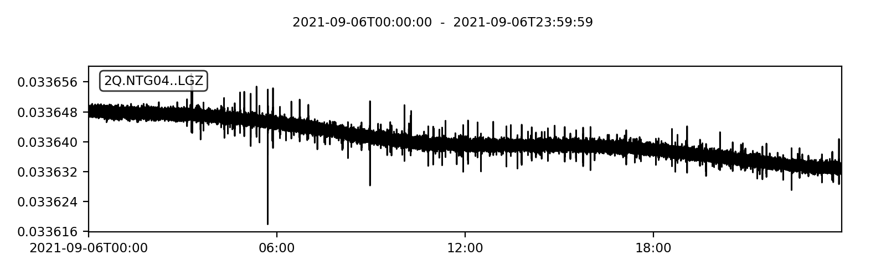

# Script to generate mSEED from Wee-g .grv file

This script loads raw Wee-g data files and converts them to the seismological mSEED standard. By default eight channels are included in the output:

* CH4R (Vertical Component of Gravity (μGal) (`LGZ`)
* AD7195_1_Ch1 (Temperature of outer thermal enclosure layer (C)) (`LK1`)
* AD7195_1_Ch2 (Temperature of main enclosure (C)) (`LK2`)
* AD7195_2_Ch1 (Temperature of sensor outside of enclosure, on top of the device (C)) (`LK3`)
* AD7195_2_Ch2 (Temperature of inner thermal enclosure layer (C)) (`LK4`)
* AD7195_3_Ch1 (Temperature of MEMS package sensor (C)) (`LK5`)
* tilt_X (Tilt in orthogonal directions of the device) (`LA1`)
* tilt_Z (Tilt in orthogonal directions of the device) (`LA2`)

## Usage
Modify the input file in the `run.py` script and pass the Wee-g input file to the WEEG2MSEED Convertor class.

## Specifics

The sampling rate of the Wee-g is 1s and the ObsPy library is used to write mSEED files. Data is split in to continuous segments (a full trace without gaps > 1s). Each gap introduces a new data segment with a new start time. The traces are bundled in a stream and written to a mSEED file per day.

## Naming

The mSEED standard has four identifiers (ASCII, N bytes): network (2), station (5), location (2), and channel (3). The network is defined here as `2Q`, the station as `NTG04` (incrementing per MEMS), the location is an empty string. The channel is defined following the mSEED standard (L) because of the 1Hz sampling rate, (G) for gravimeter, and (Z) for the z-component. In total the identifier is `2Q.NTG04..LGZ`.

## Metadata

mSEED formally uses compressed integers (STEIM2) to store data. For this reason, measurements expressed as floats (e.g., 40.003212 degree Celcius) are converted to its integer equivalent 40003212 by multiplication by 1E6. The unit is now digital counts. This correction (i.e., gain) is also present in the metadata. When using the mSEED data, the sensitivity of this conversion needs to be removed to return to physical units.

## Example

    >>> from obspy import read
    >>> st = read("2Q.NTG04..LGZ.D.2020.252")
    >>> print(st)

    5 Trace(s) in Stream:
    2Q.NTG04..LGZ | 2020-09-08T00:00:00.375000Z - 2020-09-08T00:47:17.535000Z | 1.9 Hz, 5255 samples
    2Q.NTG04..LGZ | 2020-09-08T00:49:29.274000Z - 2020-09-08T02:48:51.294000Z | 1.9 Hz, 13264 samples
    2Q.NTG04..LGZ | 2020-09-08T02:51:02.466000Z - 2020-09-08T04:50:24.486000Z | 1.9 Hz, 13264 samples
    2Q.NTG04..LGZ | 2020-09-08T04:52:35.656000Z - 2020-09-08T06:51:57.136000Z | 1.9 Hz, 13263 samples
    2Q.NTG04..LGZ | 2020-09-08T06:54:09.388000Z - 2020-09-08T07:10:12.748000Z | 1.9 Hz, 1785 samples

